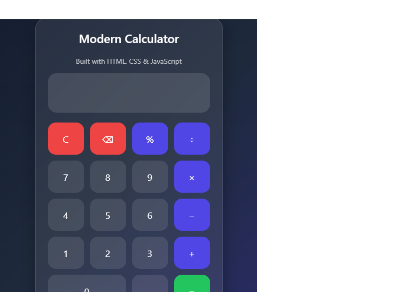

# ✨ Modern Calculator

A sleek and responsive calculator built using HTML, CSS, and JavaScript.

## 🚀 Features

- Basic arithmetic operations (+, -, ×, ÷)
- Percentage (%) support
- Delete (⌫) functionality
- Responsive design for mobile and desktop
- Modern Glassmorphism UI
- Smooth hover and click animations
- Clean and user-friendly interface

## 🛠️ Technologies Used

- HTML5
- CSS3
- JavaScript (ES6)

## 📸 Screenshot



## 📂 Project Structure

```text
calculator/
│
├── index.html
├── style.css
├── script.js
└── README.md
```

## 🌐 Live Demo

[View Live Project]( https://fareenak222-create.github.io/Modern-Calculator/)

## 💻 GitHub Repository

[GitHub Repo](https://github.com/fareenak222-create/CodeAlpha-Modern-Calculator)

## 👩‍💻 Author

Fareena Khan

- GitHub: https://github.com/fareenak222-create
- LinkedIn: https://www.linkedin.com/in/fareena-khan-1bb7a0410/

## ⭐ Future Improvements

- Dark/Light Mode Toggle
- Calculation History
- Scientific Calculator Functions
- Keyboard Support

---